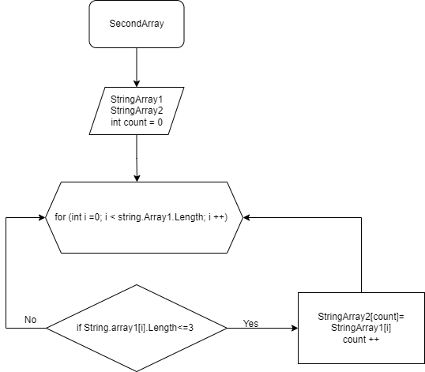

  # Задача
Написать программу,которая из имеющегося массива строк  формирует массив из строк, длина которых меньше либо равна 3 символа. Первоначальный массив можно ввести с 
 клавиатуры, либо задать на старте исключительно массивами.

 ["hello", "2","world", ":-)"] -> ["2", ":-)"]
 
 ## Блок- схема

### Решение 
Задаем два массива строк: изначальный и второй такой же длины. 
Затем объявляем метод. 
Метод принимает два массива и ничего не возвращает (void). В методе объявляем переменную count и задаем цикл равный длине массива, внутри цикла проверяем условие что длина строки первого массива <=3, если условие удовлетворяется, то элемент первого массива заносится в count элемент второго массива. Count увеличиваем на 1 и пробегаемся по циклу.

Задаем метод, void, который выводит массив на печать. Затем запускаем метод по нахождению массива строк <=3 и запускаем метод печати.
